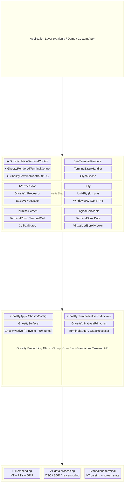

# GhosttySharp

High-performance .NET 10 bindings for the [Ghostty](https://github.com/ghostty-org/ghostty) terminal emulator, featuring four distinct integration modes, a standalone VT terminal engine, cross-platform PTY support, and full-featured Avalonia UI controls with SkiaSharp rendering.

[](https://dotnet.microsoft.com)
[](https://avaloniaui.net)
[](LICENSE)

## NuGet Packages

| Package | NuGet | Downloads | Description |
|---------|-------|-----------|-------------|
| **GhosttySharp** | [](https://www.nuget.org/packages/GhosttySharp) | [](https://www.nuget.org/packages/GhosttySharp) | Core bindings for Ghostty |
| **GhosttySharp.Avalonia** | [](https://www.nuget.org/packages/GhosttySharp.Avalonia) | [](https://www.nuget.org/packages/GhosttySharp.Avalonia) | Avalonia terminal controls |
| **GhosttySharp.Native.OSX** | [](https://www.nuget.org/packages/GhosttySharp.Native.OSX) | [](https://www.nuget.org/packages/GhosttySharp.Native.OSX) | macOS native libraries |
| **GhosttySharp.Native.Win64** | [](https://www.nuget.org/packages/GhosttySharp.Native.Win64) | [](https://www.nuget.org/packages/GhosttySharp.Native.Win64) | Windows x64 native libraries |
| **GhosttySharp.Native.Linux64** | [](https://www.nuget.org/packages/GhosttySharp.Native.Linux64) | [](https://www.nuget.org/packages/GhosttySharp.Native.Linux64) | Linux x64 native libraries |

## Features

- **Four integration modes** — Ghostty Native, Ghostty Rendered, Native VT, and Rendered — each with different trade-offs
- **Standalone VT terminal engine** — `libghostty-terminal` provides full VT emulation on all platforms without macOS embedding
- **Cross-platform PTY** — Unix PTY (`forkpty`/`TIOCSWINSZ`) and Windows ConPTY support with pixel-accurate resize
- **Zero-alloc P/Invoke** — `LibraryImport` source-generated marshalling with `DisableRuntimeMarshalling`
- **High-performance rendering** — SkiaSharp `CompositionCustomVisual` with glyph caching, dirty-row tracking, and background batching
- **256-color palette** — Configurable per-terminal palette with standard xterm defaults and per-entry override API
- **VT processor abstraction** — `IVtProcessor` with `GhosttyVtProcessor` (native) and `BasicVtProcessor` (managed) implementations
- **Virtualized scrolling** — `ILogicalScrollable` with 10,000+ row scrollback support
- **NuGet-ready** — Per-platform native dependency packages for Windows, macOS, and Linux

## Integration Modes

GhosttySharp provides four ways to integrate a terminal into your application:

| Mode | Label | VT Engine | Renderer | PTY | Platform | Airspace | Best For |
|------|-------|-----------|----------|-----|----------|----------|----------|
| **Ghostty Native** | ◆ Yellow | Ghostty (libghostty) | Metal (Ghostty) | Ghostty | macOS | ⚠️ Yes | Full native Ghostty experience |
| **Ghostty Rendered** | ● Blue | Ghostty (libghostty) | SkiaSharp | Ghostty | macOS | ✅ No | Custom rendering with Ghostty VT |
| **Native VT** | ▲ Orange | libghostty-terminal | SkiaSharp | Unix PTY / ConPTY | All | ✅ No | Cross-platform with Ghostty VT parsing |
| **Rendered** | ■ Green | BasicVtProcessor (C#) | SkiaSharp | Unix PTY / ConPTY | All | ✅ No | Pure .NET, no native deps |

> **Airspace** refers to the limitation where a native OS view (`NativeControlHost`) renders in its own surface, making it impossible to overlay Avalonia UI elements (popups, tooltips, adorners) on top of the terminal. Only Ghostty Native has this issue — the other three modes render entirely through Avalonia's composition pipeline and support full UI layering.

### Ghostty Native (◆ macOS only)

Ghostty handles everything: VT parsing, screen state, PTY management, and Metal GPU rendering. An `NSView` is hosted via Avalonia's `NativeControlHost`. Zero rendering overhead in .NET — Ghostty renders directly to the native view with ligature support and hardware acceleration.

> ⚠️ **Airspace issue:** Because this mode uses `NativeControlHost`, the terminal renders in a separate native surface. Avalonia UI elements (popups, menus, tooltips, adorners) cannot be drawn on top of the terminal area. Use Ghostty Rendered mode if you need UI overlays.

**Control:** `GhosttyNativeTerminalControl : NativeControlHost`

```
Avalonia Window
  └── NativeControlHost
        └── NSView ← Metal rendering by Ghostty
              └── GhosttySurface (VT + PTY + screen + Metal)
```

### Ghostty Rendered (● macOS only)

Uses the full `libghostty` embedding API for VT parsing and PTY management, but renders through the SkiaSharp pipeline. A hidden NSView in an off-screen window backs the Ghostty surface. Cell data is polled from Ghostty's screen state at 60fps and rendered via `CompositionCustomVisual`. Provides Ghostty's complete terminal emulation with full control over rendering.

**Control:** `GhosttyRenderedTerminalControl : Control`

```
Avalonia Window
  └── Control (CompositionCustomVisual)
        ├── TerminalDrawHandler → SkiaTerminalRenderer
        └── Hidden NSView + off-screen NSWindow
              └── GhosttySurface (VT + PTY, Metal hidden)
```

### Native VT (▲ cross-platform)

Uses `libghostty-terminal` — a standalone Zig-built shared library that wraps Ghostty's VT processing into a C API. Paired with the platform's native PTY (`forkpty` on Unix, ConPTY on Windows). Rendering via SkiaSharp. This mode brings Ghostty's battle-tested VT parsing to all platforms without the macOS-only embedding surface.

**Control:** `GhosttyTerminalControl` with `UseNativeVtProcessor="True"`

```
Avalonia Window
  └── TemplatedControl
        ├── GhosttyTerminalPresenter → CompositionCustomVisual → SkiaTerminalRenderer
        ├── GhosttyVtProcessor → libghostty-terminal (native)
        └── UnixPty / WindowsPty → Shell process
```

### Rendered (■ cross-platform, pure .NET)

Uses `BasicVtProcessor` — a fully managed C# VT100/xterm processor — with the platform PTY and SkiaSharp renderer. No native Ghostty dependencies required. Suitable as a fallback or for environments where native libraries cannot be deployed.

**Control:** `GhosttyTerminalControl` with `UseNativeVtProcessor="False"` (or auto-detect)

```
Avalonia Window
  └── TemplatedControl
        ├── GhosttyTerminalPresenter → CompositionCustomVisual → SkiaTerminalRenderer
        ├── BasicVtProcessor (pure C#)
        └── UnixPty / WindowsPty → Shell process
```

## Architecture



## Usage

### 1. Ghostty Native — Full Metal Rendering (macOS)

The highest-fidelity mode. Ghostty renders directly via Metal with ligature support.

```csharp
using GhosttySharp;
using GhosttySharp.Avalonia;

// Initialize Ghostty (once at app startup)
Ghostty.Initialize();
using var config = new GhosttyConfig();
config.LoadDefaultFiles();
config.Set("font-size", "14");
config.Finalize_();
using var app = new GhosttyApp(config);

// Start the Ghostty event loop (16ms tick)
var tickTimer = new DispatcherTimer { Interval = TimeSpan.FromMilliseconds(16) };
tickTimer.Tick += (_, _) => app.Tick();
tickTimer.Start();

// Create the native terminal control
var terminal = new GhosttyNativeTerminalControl
{
    TerminalFontSize = 14.0f,
    WorkingDirectory = Environment.GetFolderPath(Environment.SpecialFolder.UserProfile),
};
terminal.Initialize(app);

// Handle events
terminal.TitleChanged += (_, title) => window.Title = title;
terminal.ProcessExited += (_, code) => Console.WriteLine($"Exited: {code}");
terminal.CloseRequested += (_, _) => CloseTab();
terminal.TerminalResized += (_, args) =>
    Console.WriteLine($"Grid: {args.Columns}x{args.Rows}");

// Add to visual tree
contentPanel.Children.Add(terminal);
terminal.Focus();
```

### 2. Ghostty Rendered — Custom SkiaSharp Rendering (macOS)

Ghostty handles VT parsing and PTY, you control rendering via SkiaSharp.

```csharp
using GhosttySharp;
using GhosttySharp.Avalonia;

// Initialize Ghostty (same as Native mode)
Ghostty.Initialize();
using var config = new GhosttyConfig();
config.LoadDefaultFiles();
config.Finalize_();
using var app = new GhosttyApp(config);

var tickTimer = new DispatcherTimer { Interval = TimeSpan.FromMilliseconds(16) };
tickTimer.Tick += (_, _) => app.Tick();
tickTimer.Start();

// Create rendered terminal (SkiaSharp rendering, Ghostty VT)
var terminal = new GhosttyRenderedTerminalControl
{
    TerminalFontSize = 14.0f,
    FontFamilyName = "JetBrains Mono",
    WorkingDirectory = Environment.GetFolderPath(Environment.SpecialFolder.UserProfile),
};
terminal.Initialize(app);

// Events
terminal.TitleChanged += (_, title) => window.Title = title;
terminal.ProcessExited += (_, code) => Console.WriteLine($"Exited: {code}");

// Color scheme control
terminal.SetColorScheme(GhosttyColorScheme.Dark);

// Clipboard
await terminal.CopySelectionAsync();
await terminal.PasteAsync();

contentPanel.Children.Add(terminal);
terminal.Focus();
```

### 3. Native VT — Cross-Platform with Ghostty VT Engine

Uses `libghostty-terminal` for VT parsing with a native PTY. Works on all platforms.

**XAML:**

```xml
<Window xmlns:ghostty="using:GhosttySharp.Avalonia">
    <ghostty:GhosttyTerminalControl
        FontFamilyName="JetBrains Mono"
        TerminalFontSize="14"
        Columns="120"
        Rows="40"
        ScrollbackLimit="10000"
        UseNativeVtProcessor="True"
        DefaultForeground="#D4D4D4"
        DefaultBackground="#1E1E1E"
        AutoScroll="True" />
</Window>
```

**Code-behind:**

```csharp
using GhosttySharp.Avalonia;

// No Ghostty initialization needed — uses standalone libghostty-terminal
var terminal = this.FindControl<GhosttyTerminalControl>("Terminal");

// Start a shell with PTY
terminal.StartPty(
    workingDirectory: Environment.GetFolderPath(Environment.SpecialFolder.UserProfile)
);

// Events
terminal.DataReceived += (_, args) =>
    Console.WriteLine($"Received {args.Data.Length} bytes");
terminal.TerminalResized += (_, args) =>
    Console.WriteLine($"Resized to {args.Columns}x{args.Rows}");
terminal.TitleChanged += (_, title) => window.Title = title;
terminal.Bell += (_, _) => SystemSounds.Beep.Play();

// Programmatic I/O
terminal.SendInput("echo Hello\r");

// Selection & clipboard
await terminal.CopySelectionAsync();
await terminal.PasteAsync();

// Scroll control
terminal.ScrollToBottom();
terminal.ScrollByRows(-10);

// Cleanup
terminal.StopPty();
```

### 4. Rendered — Pure .NET Fallback (Cross-Platform)

No native Ghostty dependencies. Uses the managed `BasicVtProcessor` with a native PTY.

```csharp
using GhosttySharp.Avalonia;

// Force managed VT processor (no native library needed)
var terminal = new GhosttyTerminalControl
{
    FontFamilyName = "Consolas",
    TerminalFontSize = 14.0,
    Columns = 120,
    Rows = 40,
    ScrollbackLimit = 10_000,
    DefaultForeground = Color.FromRgb(0xD4, 0xD4, 0xD4),
    DefaultBackground = Color.FromRgb(0x1E, 0x1E, 0x1E),
    UseNativeVtProcessor = false,  // Force BasicVtProcessor
    AutoScroll = true,
};

terminal.StartPty(
    workingDirectory: Environment.GetFolderPath(Environment.SpecialFolder.UserProfile)
);

contentPanel.Children.Add(terminal);
terminal.Focus();
```

### Writing Data Directly (No PTY)

Useful for testing, log display, or custom data rendering without a shell:

```csharp
var terminal = new GhosttyTerminalControl();

// Write raw VT data
terminal.WriteOutput("\x1B[31mRed text\x1B[0m Normal text\r\n"u8);

// Truecolor output
terminal.WriteOutput("\x1B[38;2;100;200;50mTruecolor!\x1B[0m\r\n"u8);

// Box drawing with DEC line charset
terminal.WriteOutput("\x1B[5;10H\x1B(0lqqqqk\x1B[6;10Hx    x\x1B[7;10Hmqqqqj\x1B(B"u8);
// Renders: ┌────┐
//          │    │
//          └────┘
```

### VT Processor Auto-Detection

The `UseNativeVtProcessor` property controls which VT engine is used:

| Value | Behavior |
|-------|----------|
| `null` (default) | Auto-detect: try `libghostty-terminal`, fall back to `BasicVtProcessor` |
| `true` | Force `GhosttyVtProcessor` (requires `libghostty-terminal`) |
| `false` | Force `BasicVtProcessor` (pure managed C#) |

Check at runtime:
```csharp
bool isNative = terminal.IsUsingNativeVtProcessor;
```

## The Standalone Terminal Library (libghostty-terminal)

A standalone C library built from Ghostty's Zig VT modules. Provides full terminal emulation (VT parsing, screen state, modes, colors) without the macOS embedding surface.

### C API

```c
// Lifecycle
ghostty_terminal_t ghostty_terminal_new(uint32_t cols, uint32_t rows, uint32_t max_scrollback);
void               ghostty_terminal_free(ghostty_terminal_t handle);

// VT processing (persistent parser state — handles split escape sequences)
void ghostty_terminal_process(ghostty_terminal_t handle, const uint8_t *data, size_t len);

// Screen state
uint32_t ghostty_terminal_get_cols(ghostty_terminal_t handle);
uint32_t ghostty_terminal_get_rows(ghostty_terminal_t handle);
void     ghostty_terminal_get_cursor(ghostty_terminal_t handle, ghostty_cursor_info_t *out);
uint32_t ghostty_terminal_get_row_cells(ghostty_terminal_t handle, uint32_t row,
                                         ghostty_cell_info_t *cells, uint32_t max_cells);

// Resize
void ghostty_terminal_resize(ghostty_terminal_t handle, uint32_t cols, uint32_t rows);

// Color configuration
void ghostty_terminal_set_default_colors(ghostty_terminal_t handle, uint32_t fg_argb, uint32_t bg_argb);
void ghostty_terminal_set_palette_color(ghostty_terminal_t handle, uint8_t idx,
                                         uint8_t r, uint8_t g, uint8_t b);

// Terminal mode queries
uint8_t ghostty_terminal_get_mode_app_cursor(ghostty_terminal_t handle);
uint8_t ghostty_terminal_get_mode_app_keypad(ghostty_terminal_t handle);
uint8_t ghostty_terminal_get_mode_bracketed_paste(ghostty_terminal_t handle);
uint8_t ghostty_terminal_get_mode_alt_screen(ghostty_terminal_t handle);

// Self-test (returns 0 on success)
uint32_t ghostty_terminal_self_test(void);
```

### Building from Source

Requires [Zig 0.15.2+](https://ziglang.org/download/) and the Ghostty submodule:

```bash
# Initialize the Ghostty submodule
git submodule update --init --recursive

# Build the native library
cd native/ghostty-terminal
bash build.sh release       # → zig-out/lib/libghostty-terminal.{dylib,so}

# Install to native packages
cp zig-out/lib/libghostty-terminal.dylib ../../native/osx-arm64/

# Other build targets
bash build.sh debug          # Debug build
bash build.sh release-safe   # Release with safety checks
bash build.sh test           # Run native tests
bash build.sh clean          # Clean build artifacts
```

The build system uses `build.zig` which pulls Ghostty's VT modules as a Zig dependency and produces a shared library with a C-compatible API.

### .NET Bindings

The C API is exposed in .NET via source-generated P/Invoke:

```csharp
// All 15 functions are bound via [LibraryImport("ghostty-terminal")]
GhosttyTerminalNative.TerminalNew(cols, rows, maxScrollback);
GhosttyTerminalNative.TerminalProcess(handle, dataPtr, len);
GhosttyTerminalNative.TerminalGetRowCells(handle, row, cellsPtr, maxCells);
GhosttyTerminalNative.TerminalResize(handle, cols, rows);
GhosttyTerminalNative.TerminalSetDefaultColors(handle, fgArgb, bgArgb);
GhosttyTerminalNative.TerminalSetPaletteColor(handle, index, r, g, b);
// ... etc.

// Check availability at runtime
bool available = GhosttyTerminalNative.IsAvailable();
```

## PTY Support

The PTY layer provides cross-platform pseudo-terminal support via the `IPty` interface:

```csharp
// Unix PTY (macOS / Linux)
var pty = new UnixPty();
pty.Start(shell: null, columns: 80, rows: 24,
          workingDirectory: Environment.GetFolderPath(Environment.SpecialFolder.UserProfile));
pty.DataReceived += (data, length) => { /* process output */ };
pty.Write("echo Hello\n");
pty.Resize(120, 40, widthPixels: 960, heightPixels: 640);  // Pixel-accurate

// Windows ConPTY
var pty = new WindowsPty();
pty.Start(shell: null, columns: 80, rows: 24);
```

| Feature | Unix PTY | Windows ConPTY |
|---------|----------|----------------|
| Creation | POSIX `forkpty()` | `CreatePseudoConsole()` |
| Resize | `ioctl(TIOCSWINSZ)` + `SIGWINCH` | `ResizePseudoConsole()` |
| Pixel dimensions | `ws_xpixel` / `ws_ypixel` | N/A |
| Shell detection | `$SHELL` → `/bin/zsh` → `/bin/bash` | `cmd.exe` / `powershell` |
| Fork safety | All native memory pre-allocated before `fork()` | N/A |
| Read loop | Background thread, 8KB buffer | Async pipe read |

## VT Processor API

Both VT processors implement `IVtProcessor`:

```csharp
public interface IVtProcessor : IDisposable
{
    int CursorCol { get; }
    int CursorRow { get; }
    bool CursorVisible { get; }
    bool ApplicationCursorKeys { get; }
    void Process(ReadOnlySpan<byte> data);
    void NotifyResize(int columns, int rows);
    void Reset();
}
```

**`GhosttyVtProcessor`** — Wraps `libghostty-terminal` via P/Invoke. Persistent VT parser state across `Process()` calls handles split escape sequences correctly. Configures standard xterm-256 palette by default. Syncs native terminal screen state back to the managed `TerminalScreen` after each process call using `stackalloc` cell buffers.

**`BasicVtProcessor`** — Fully managed C# implementation (~1,400 lines). Handles CSI, OSC, DCS sequences, alternate screen buffer, scroll regions, tab stops, DEC line drawing charset, cursor save/restore, and all common SGR attributes including truecolor. No native dependencies.

## Native Libraries

GhosttySharp uses up to three native libraries depending on the integration mode:

| Library | Size | Platform | Used By | Purpose |
|---------|------|----------|---------|---------|
| `libghostty` | 17.5 MB | macOS | Ghostty Native, Ghostty Rendered | Full embedding (VT + PTY + Metal) |
| `libghostty-vt` | 758 KB | All | VT data processing only | OSC/SGR parsing, key encoding |
| `libghostty-terminal` | 1.3 MB | All | Native VT mode | Standalone terminal (VT + screen state) |

### Library Placement

| Platform | Libraries | Search Paths |
|----------|-----------|-------------|
| Windows | `ghostty.dll`, `ghostty-terminal.dll` | App directory, `PATH`, `runtimes/win-x64/native/` |
| macOS | `libghostty.dylib`, `libghostty-terminal.dylib` | App directory, `/usr/local/lib/`, `runtimes/osx-arm64/native/` |
| Linux | `libghostty.so`, `libghostty-terminal.so` | App directory, `/usr/lib/`, `/usr/local/lib/`, `runtimes/linux-x64/native/` |

## Project Structure

```
GhosttySharp/
├── Directory.Build.props               # Shared: net10.0, AllowUnsafeBlocks, TreatWarningsAsErrors
├── GhosttySharp.sln
├── external/
│   └── ghostty/                        # Ghostty git submodule
├── native/
│   ├── ghostty-terminal/               # Standalone terminal library (Zig)
│   │   ├── build.zig                   # Zig build config (shared lib, links ghostty-vt module)
│   │   ├── build.zig.zon               # Package deps (Ghostty path dep, min Zig 0.15.2)
│   │   ├── build.sh                    # Build script (debug/release/test/clean)
│   │   └── src/main.zig               # C API implementation (399 lines, 15 exports)
│   ├── include/ghostty/                # Ghostty C headers
│   └── osx-arm64/                      # Pre-built macOS native libraries
│       ├── libghostty.dylib            # Full embedding (17.5 MB)
│       ├── libghostty-vt.dylib         # VT data processing (758 KB)
│       └── libghostty-terminal.dylib   # Standalone terminal (1.3 MB)
├── src/
│   ├── GhosttySharp/                   # Core bindings library
│   │   ├── Native/
│   │   │   ├── Enums.cs                # Ghostty enum types (634 lines)
│   │   │   ├── Structs.cs              # Blittable interop structs (546 lines)
│   │   │   ├── Delegates.cs            # Managed callback delegates
│   │   │   ├── GhosttyNative.cs        # libghostty P/Invoke (60+ functions)
│   │   │   ├── GhosttyVtNative.cs      # libghostty-vt P/Invoke
│   │   │   ├── GhosttyTerminalNative.cs# libghostty-terminal P/Invoke (15 functions)
│   │   │   └── NativeLibraryLoader.cs  # Cross-platform DllImportResolver
│   │   ├── Terminal/
│   │   │   ├── TerminalBuffer.cs       # Ring buffer with ArrayPool<byte>
│   │   │   └── TerminalDataProcessor.cs# SIMD UTF-8 processing
│   │   ├── GhosttyApp.cs              # Application lifecycle wrapper
│   │   ├── GhosttyConfig.cs           # Configuration wrapper
│   │   ├── GhosttySurface.cs          # Terminal surface wrapper (453 lines)
│   │   └── GhosttyInspector.cs        # Debug inspector wrapper
│   ├── GhosttySharp.Avalonia/          # Avalonia UI terminal controls
│   │   ├── Terminal/
│   │   │   ├── IVtProcessor.cs         # VT processor interface
│   │   │   ├── GhosttyVtProcessor.cs   # Native VT (wraps libghostty-terminal)
│   │   │   ├── BasicVtProcessor.cs     # Managed VT (pure C#, ~1,400 lines)
│   │   │   ├── IPty.cs                 # PTY abstraction interface
│   │   │   ├── UnixPty.cs             # Unix PTY (forkpty, TIOCSWINSZ)
│   │   │   └── WindowsPty.cs          # Windows ConPTY
│   │   ├── Rendering/
│   │   │   ├── TerminalCell.cs         # Cell/Row/Screen model (TerminalScreen)
│   │   │   ├── SkiaTerminalRenderer.cs # SkiaSharp grid renderer with glyph cache
│   │   │   ├── TerminalDrawHandler.cs  # CompositionCustomVisualHandler
│   │   │   └── GlyphCache.cs          # SKTypeface + glyph metrics cache
│   │   ├── Scrolling/
│   │   │   ├── TerminalScrollData.cs   # Scroll state management
│   │   │   └── VirtualizedTerminalScrollViewer.cs
│   │   ├── GhosttyTerminalControl.cs   # Standalone terminal (PTY modes, 1,153 lines)
│   │   ├── GhosttyRenderedTerminalControl.cs # Ghostty Rendered mode (843 lines)
│   │   ├── GhosttyNativeTerminalControl.cs   # Ghostty Native mode (699 lines)
│   │   ├── GhosttyTerminalPresenter.cs # CustomVisual bridge
│   │   └── MacKeyMapping.cs           # Avalonia Key → macOS virtual keycodes
│   ├── GhosttySharp.Native.Win64/      # Windows x64 native NuGet package
│   ├── GhosttySharp.Native.OSX/        # macOS native NuGet package
│   └── GhosttySharp.Native.Linux64/    # Linux x64 native NuGet package
├── samples/
│   └── GhosttySharp.Demo/             # Multi-tab demo with all 4 modes
├── tests/
│   ├── GhosttySharp.Tests/            # Unit tests (135 tests, 8 files)
│   └── GhosttySharp.IntegrationTests/ # Native integration tests (38 tests)
├── scripts/                            # Build & deployment scripts
│   ├── build-native.sh                 # Shell build script for native libs
│   ├── build-native.ps1                # PowerShell build script
│   ├── run-integration-tests.sh        # Integration test runner
│   └── validate-macos.sh              # macOS validation
└── plan/                               # Design specifications & progress docs
```

## Technical Details

### Interop Strategy

- **`[LibraryImport]`** with source-generated marshalling across three native libraries
- **`[assembly: DisableRuntimeMarshalling]`** for blittable struct interop
- **`[UnmanagedCallersOnly]`** for native-to-managed callback trampolines
- All `bool` parameters use `byte` to comply with `DisableRuntimeMarshalling`
- `NativeLibrary.SetDllImportResolver` for cross-platform library resolution
- Unmanaged function pointers (`delegate* unmanaged[Cdecl]`) for Ghostty runtime callbacks

### Rendering Pipeline

1. **TerminalScreen** — cell grid with dirty-row tracking, viewport/scrollback separation, thread-safe `SyncRoot`
2. **SkiaTerminalRenderer** — background batching (adjacent same-color cells → single `DrawRect`), per-cell text rendering with styled `SKFont`, cursor/selection/decoration passes
3. **TerminalDrawHandler** — `CompositionCustomVisualHandler` acquires SkiaSharp canvas lease from Avalonia's compositor
4. **GhosttyTerminalPresenter** — Avalonia `Control` that owns the `CompositionCustomVisual`
5. **GhosttyTerminalControl** — `TemplatedControl` orchestrating input, scrolling, PTY, and rendering

Color handling:
- All colors packed as `0xAARRGGBB` (`uint`), matching `SKColor(uint)` format
- Inverse/reverse video swaps fg/bg during both text and background rendering
- Bold foreground promotes standard palette colors 0–7 to bright 8–15
- 256-color palette configurable per-terminal via C API or `TerminalScreen` defaults

### Color Configuration

```csharp
// Native VT processor — standard xterm palette is set automatically.
// Override individual palette entries at the native level:
GhosttyTerminalNative.TerminalSetPaletteColor(handle, 0, 0x00, 0x00, 0x00); // black
GhosttyTerminalNative.TerminalSetPaletteColor(handle, 1, 0xCD, 0x00, 0x00); // red

// Set default fg/bg for unstyled cells:
GhosttyTerminalNative.TerminalSetDefaultColors(handle, 0xFFD4D4D4, 0xFF1E1E1E);
```

### Thread Safety

```
UI Thread                          Compositor Thread
─────────                          ─────────────────
VtProcessor.Process()              TerminalDrawHandler.OnRender()
  lock(screen.SyncRoot)              lock(screen.SyncRoot)
    write cells                        read cells + render
  unlock                             unlock
```

### Scroll Virtualization

- `ILogicalScrollable` implementation for Avalonia's logical scroll system
- Only visible rows are rendered; scrollback rows are virtualized (10,000 row default)
- `TerminalScrollData` tracks viewport offset, extent, and auto-scroll state

## Feature Comparison

| Feature | Ghostty Native | Ghostty Rendered | Native VT | Rendered |
|---------|----------------|------------------|-----------|----------|
| VT engine | Ghostty (Zig) | Ghostty (Zig) | Ghostty (Zig) | BasicVtProcessor (C#) |
| Renderer | Metal (GPU) | SkiaSharp | SkiaSharp | SkiaSharp |
| PTY | Ghostty | Ghostty | UnixPty/ConPTY | UnixPty/ConPTY |
| macOS | ✅ | ✅ | ✅ | ✅ |
| Linux | ❌ | ❌ | ✅ | ✅ |
| Windows | ❌ | ❌ | ✅ (ConPTY) | ✅ (ConPTY) |
| Native library | libghostty | libghostty | libghostty-terminal | None |
| Ligature support | ✅ | ❌ | ❌ | ❌ |
| GPU acceleration | ✅ Metal | Via Skia | Via Skia | Via Skia |
| Rendering control | ❌ Ghostty | ✅ Full | ✅ Full | ✅ Full |
| TUI apps (mc, vim) | ✅ Full | ✅ Full | ✅ Full | ✅ Supported |
| Truecolor (24-bit) | ✅ | ✅ | ✅ | ✅ |
| Unicode/CJK | ✅ | ✅ | ✅ | ✅ |
| Split panes | ✅ | ✅ | ❌ | ❌ |
| Inspector | ✅ | ✅ | ❌ | ❌ |
| Scrollback | Ghostty | Ghostty | 10K (configurable) | 10K (configurable) |
| Selection | Ghostty native | Ghostty native | Mouse-based | Mouse-based |
| Clipboard | OSC 52 | OSC 52 | Avalonia clipboard | Avalonia clipboard |
| CPU idle | ~1% | ~2-3% (polling) | ~0% (event-driven) | ~0% (event-driven) |
| Airspace gap | ⚠️ Yes | ✅ No | ✅ No | ✅ No |
| Avalonia UI overlay | ❌ Blocked | ✅ Full | ✅ Full | ✅ Full |

## Building

### Prerequisites

- [.NET 10 SDK](https://dotnet.microsoft.com/download/dotnet/10.0) or later
- [Zig 0.15.2+](https://ziglang.org/download/) (only for building `libghostty-terminal`)
- One or more native libraries depending on the mode:
  - **Native VT**: `libghostty-terminal` (all platforms)
  - **Ghostty Native / Rendered**: `libghostty` (macOS only)
  - **Rendered (pure .NET)**: no native library required

### Build Commands

```bash
# Build everything
dotnet build

# Run all tests (135 unit + 38 integration = 173 total)
dotnet test

# Run unit tests only
dotnet test tests/GhosttySharp.Tests/

# Run integration tests (requires native library)
dotnet test tests/GhosttySharp.IntegrationTests/

# Run the demo app
cd samples/GhosttySharp.Demo
dotnet run

# Create NuGet packages
dotnet pack -c Release
```

### Building the Native Terminal Library

```bash
# Ensure the Ghostty submodule is initialized
git submodule update --init --recursive

# Build
cd native/ghostty-terminal
bash build.sh release

# Output: zig-out/lib/libghostty-terminal.{dylib,so}

# Install to project
cp zig-out/lib/libghostty-terminal.dylib ../../native/osx-arm64/
cp zig-out/lib/libghostty-terminal.dylib \
   ../../src/GhosttySharp.Native.OSX/runtimes/osx-arm64/native/
```

### Installation (NuGet)

```bash
# Core bindings
dotnet add package GhosttySharp

# Avalonia terminal controls
dotnet add package GhosttySharp.Avalonia

# Native dependencies (choose per platform)
dotnet add package GhosttySharp.Native.OSX
dotnet add package GhosttySharp.Native.Win64
dotnet add package GhosttySharp.Native.Linux64
```

## Demo Application

The included demo app (`samples/GhosttySharp.Demo`) is a multi-tab terminal that supports all four integration modes:

| Shortcut | Action |
|----------|--------|
| Ctrl+T | New tab |
| Ctrl+W | Close tab |
| Ctrl+Tab | Cycle tabs |
| Ctrl+1–9 | Switch to tab N |
| Ctrl+±/0 | Font size adjust/reset |
| Ctrl+Shift+C/V | Copy/Paste |
| Mode button | Cycle through available modes |
| Theme button | Toggle dark/light |

On startup, the demo auto-detects available native libraries. On macOS, all four modes are available. On other platforms, only Native VT (▲) and Rendered (■) are offered.

```bash
cd samples/GhosttySharp.Demo
dotnet run
```

## Testing

```bash
# All tests (173 total)
dotnet test

# Unit tests (135) — struct layouts, SIMD processing, screen model, rendering, scroll state
dotnet test tests/GhosttySharp.Tests/

# Integration tests (38) — native library self-test, terminal lifecycle, VT processing,
#                           SGR handling, split sequences, resize, cell population
dotnet test tests/GhosttySharp.IntegrationTests/
```

Integration tests gracefully skip if the native library is unavailable.

## API Coverage

### libghostty (Full Embedding)

| Category | Examples | Status |
|----------|----------|--------|
| Initialization | `ghostty_init` | ✅ |
| Configuration | `config_new`, `config_set`, `config_load_*`, `config_finalize` | ✅ |
| Application | `app_new`, `app_free`, `app_tick` | ✅ |
| Surface | `surface_new`, `surface_free`, `surface_key`, `surface_text`, `surface_mouse_*` | ✅ |
| Surface State | `surface_size`, `surface_focus`, `surface_scale`, `surface_clipboard` | ✅ |
| Screen Reading | `surface_screen_lock/unlock`, `surface_cursor_info`, `surface_get_row_cells` | ✅ |
| Inspector | `inspector_new`, `inspector_free`, `inspector_toggle` | ✅ |
| Selection | `surface_selection`, `surface_binding_action` | ✅ |

### libghostty-terminal (Standalone · 15 functions)

| Category | Functions | Status |
|----------|-----------|--------|
| Lifecycle | `terminal_new`, `terminal_free` | ✅ |
| Processing | `terminal_process` (persistent stream) | ✅ |
| Screen State | `terminal_get_cols/rows`, `terminal_get_cursor`, `terminal_get_row_cells` | ✅ |
| Resize | `terminal_resize` | ✅ |
| Colors | `terminal_set_default_colors`, `terminal_set_palette_color` | ✅ |
| Mode Queries | `terminal_get_mode_app_cursor/app_keypad/bracketed_paste/alt_screen` | ✅ |
| Diagnostics | `terminal_self_test` | ✅ |

## License

[MIT](LICENSE)

## Acknowledgements

- [Ghostty](https://github.com/ghostty-org/ghostty) — The terminal emulator engine
- [Avalonia UI](https://avaloniaui.net/) — Cross-platform .NET UI framework
- [SkiaSharp](https://github.com/mono/SkiaSharp) — .NET bindings for the Skia graphics library
- [Zig](https://ziglang.org/) — Language used to build the standalone terminal library
