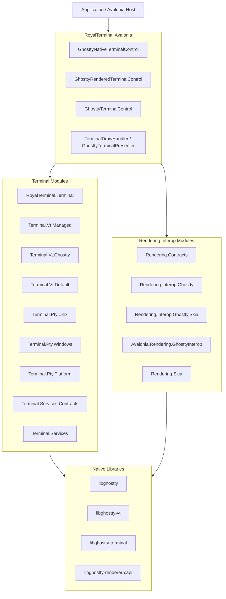

# RoyalTerminal

High-performance .NET 10 bindings for the [Ghostty](https://github.com/ghostty-org/ghostty) terminal emulator with four integration modes, modular terminal/PTY/VT packages, and a split rendering stack (contracts, native interop, Skia bridge, and Avalonia adapters).

[](https://dotnet.microsoft.com)
[](https://avaloniaui.net)
[](LICENSE)

## NuGet Packages

### Primary Packages

| Package | NuGet | Description |
|---------|-------|-------------|
| **RoyalTerminal.GhosttySharp** | [](https://www.nuget.org/packages/RoyalTerminal.GhosttySharp) | Core Ghostty bindings (`libghostty`, `libghostty-vt`, `libghostty-terminal`) |
| **RoyalTerminal.Avalonia** | [](https://www.nuget.org/packages/RoyalTerminal.Avalonia) | Avalonia controls (`GhosttyNativeTerminalControl`, `GhosttyRenderedTerminalControl`, `GhosttyTerminalControl`) |
| **RoyalTerminal.GhosttySharp.Native.OSX** | [](https://www.nuget.org/packages/RoyalTerminal.GhosttySharp.Native.OSX) | Native runtime assets for macOS (`libghostty`, `libghostty-vt`, `libghostty-terminal`, `libghostty-renderer-capi`) |
| **RoyalTerminal.GhosttySharp.Native.Win64** | [](https://www.nuget.org/packages/RoyalTerminal.GhosttySharp.Native.Win64) | Native runtime assets for Windows x64 (`ghostty.dll`, `ghostty-vt.dll`, `ghostty-terminal.dll`, `ghostty-renderer-capi.dll`) |
| **RoyalTerminal.GhosttySharp.Native.Linux64** | [](https://www.nuget.org/packages/RoyalTerminal.GhosttySharp.Native.Linux64) | Native runtime assets for Linux (`libghostty.so`, `libghostty-vt.so`, `libghostty-terminal.so`, `libghostty-renderer-capi.so`) |

### Modular Managed Packages (Packable Composition Units)

| Package | Responsibility |
|---------|----------------|
| `RoyalTerminal.Terminal` | Core terminal contracts and screen model |
| `RoyalTerminal.Terminal.Vt.Managed` | Managed VT processor (`BasicVtProcessor`) |
| `RoyalTerminal.Terminal.Vt.Ghostty` | Native VT processor (`GhosttyVtProcessor` over `libghostty-terminal`) |
| `RoyalTerminal.Terminal.Vt.Default` | Auto-selection VT processor factory |
| `RoyalTerminal.Terminal.Pty.Unix` | Unix PTY implementation (`forkpty`) |
| `RoyalTerminal.Terminal.Pty.Windows` | Windows PTY implementation (ConPTY) |
| `RoyalTerminal.Terminal.Pty.Platform` | Platform PTY factory (`DefaultPtyFactory`) |
| `RoyalTerminal.Terminal.Services.Contracts` | Terminal session service contracts |
| `RoyalTerminal.Terminal.Services` | Terminal session service implementations |
| `RoyalTerminal.Rendering.Text` | Reusable text shaping/fallback subsystem (`HarfBuzzTextShaper`, `TerminalFontResolver`) |
| `RoyalTerminal.Rendering.Skia` | CPU cell renderer core (`SkiaTerminalRenderer`, `GlyphCache`) with HarfBuzz shaping + fallback font resolution |
| `RoyalTerminal.Rendering.Contracts` | Backend-agnostic render contracts (`RenderTargetDescriptor`, capabilities) |
| `RoyalTerminal.Rendering.Interop.Ghostty` | Managed wrapper for `ghostty-renderer-capi` |
| `RoyalTerminal.Rendering.Interop.Ghostty.Skia` | Skia bridge (`SkiaInteropRenderer`) with CPU fallback |
| `RoyalTerminal.Avalonia.Rendering.GhosttyInterop` | Avalonia render-target acquisition and texture interop draw handler |

## Features

- **Four integration modes** with explicit trade-offs between fidelity, portability, and native dependencies.
- **Split rendering architecture**:
  - CPU cell rendering path (`RoyalTerminal.Rendering.Skia`)
  - GPU interop path (`RoyalTerminal.Rendering.*` + `ghostty-renderer-capi`)
- **Ghostty Rendered TextureInterop mode** in `GhosttyRenderedTerminalControl`.
- **Standalone VT engine** via `libghostty-terminal` on all platforms.
- **Modular PTY and VT packages** (`Terminal.Pty.*`, `Terminal.Vt.*`).
- **HarfBuzz-backed text shaping** with grid-safe fallback behavior and optional diagnostics counters.
- **Grapheme-aware cell model** in managed VT and native VT/surface readback paths.
- **Terminal session service split** (`Terminal.Services.Contracts` and `Terminal.Services`).
- **Native artifact pipeline** for macOS/Linux/Windows, consumed by managed build/test/pack stages.
- **Central NuGet package management** via `Directory.Packages.props`.
- **ReactiveUI only in sample app** (`samples/RoyalTerminal.Demo`); library projects are not ReactiveUI-dependent.

## Integration Modes

| Mode | Label | VT Engine | Renderer | PTY | Platform | Airspace | Best For |
|------|-------|-----------|----------|-----|----------|----------|----------|
| **Ghostty Native** | ◆ Yellow | Ghostty (`libghostty`) | Metal (Ghostty) | Ghostty | macOS | Yes | Maximum native fidelity |
| **Ghostty Rendered** | ● Blue | Ghostty (`libghostty`) | Skia (`CpuCellRenderer`) or renderer interop (`TextureInterop`) | Ghostty | macOS | No | Ghostty behavior with composited rendering |
| **Native VT** | ▲ Orange | `libghostty-terminal` | Skia cell renderer | Unix PTY / ConPTY | All | No | Cross-platform Ghostty VT parser |
| **Rendered** | ■ Green | `BasicVtProcessor` (C#) | Skia cell renderer | Unix PTY / ConPTY | All | No | Pure managed VT fallback |

### Ghostty Rendered Rendering Modes

| `GhosttyRenderedTerminalRenderingMode` | Path | Notes |
|----------------------------------------|------|-------|
| `CpuCellRenderer` | Read Ghostty screen cells and paint with `SkiaTerminalRenderer` | Existing rendered mode, full Avalonia composition |
| `TextureInterop` | `ghostty-renderer-capi` + `SkiaInteropRenderer` + `TerminalTextureInteropDrawHandler` | Backend-aware target acquisition with CPU RGBA fallback |

> Airspace applies only to `GhosttyNativeTerminalControl` because it hosts an OS-native view (`NativeControlHost`).

## Architecture



## Usage

### 1. Ghostty Native (macOS)

```csharp
using RoyalTerminal.GhosttySharp;
using RoyalTerminal.Avalonia.Controls;

Ghostty.Initialize();
using var config = new GhosttyConfig();
config.LoadDefaultFiles();
config.Finalize_();
using var app = new GhosttyApp(config);

var terminal = new GhosttyNativeTerminalControl
{
    TerminalFontSize = 14.0f,
    WorkingDirectory = Environment.GetFolderPath(Environment.SpecialFolder.UserProfile),
};

terminal.Initialize(app);
```

### 2. Ghostty Rendered (CPU Cell Renderer)

```csharp
using RoyalTerminal.GhosttySharp;
using RoyalTerminal.Avalonia.Controls;

Ghostty.Initialize();
using var config = new GhosttyConfig();
config.LoadDefaultFiles();
config.Finalize_();
using var app = new GhosttyApp(config);

var terminal = new GhosttyRenderedTerminalControl
{
    RenderingMode = GhosttyRenderedTerminalRenderingMode.CpuCellRenderer,
    FontFamilyName = "JetBrains Mono",
    TerminalFontSize = 14.0f,
};

terminal.Initialize(app);
```

### 3. Ghostty Rendered (TextureInterop)

```csharp
using RoyalTerminal.GhosttySharp;
using RoyalTerminal.Avalonia.Controls;
using RoyalTerminal.Avalonia.Rendering.GhosttyInterop.Interop;

Ghostty.Initialize();
using var config = new GhosttyConfig();
config.LoadDefaultFiles();
config.Finalize_();
using var app = new GhosttyApp(config);

var terminal = new GhosttyRenderedTerminalControl
{
    RenderingMode = GhosttyRenderedTerminalRenderingMode.TextureInterop,
    InteropRenderTargetProvider = new AvaloniaSkiaRenderTargetProvider(
        backendPreference: AvaloniaRenderBackendPreference.Auto),
    TerminalFontSize = 14.0f,
};

terminal.Initialize(app);
```

### 4. Cross-Platform Terminal Control (`GhosttyTerminalControl`)

```csharp
using RoyalTerminal.Avalonia.Controls;

var terminal = new GhosttyTerminalControl
{
    FontFamilyName = "JetBrains Mono",
    TerminalFontSize = 14,
    Columns = 120,
    Rows = 40,
    ScrollbackLimit = 10000,

    // null = auto, true = force native VT, false = force managed VT
    UseNativeVtProcessor = null,
};

terminal.StartPty(
    workingDirectory: Environment.GetFolderPath(Environment.SpecialFolder.UserProfile));
```

### 5. Renderer Shaping Controls and Diagnostics

```csharp
using RoyalTerminal.Avalonia.Controls;
using RoyalTerminal.Avalonia.Rendering;

var terminal = new GhosttyTerminalControl();
terminal.StartPty();

// Available after control initialization.
if (terminal.Renderer is { } renderer)
{
    renderer.EnableTextShaping = true;                 // rollout switch
    renderer.TextDirectionMode = TextDirectionMode.Auto;
    renderer.EnableLigatures = false;                  // terminal-safe default
    renderer.EnableTextRenderDiagnostics = true;

    TextRenderDiagnostics diagnostics = renderer.GetTextRenderDiagnostics(reset: true);
}
```

### 6. Direct Renderer Interop (No Avalonia Adapter)

```csharp
using RoyalTerminal.Rendering.Contracts;
using RoyalTerminal.Rendering.Interop.Ghostty;

using var context = new GhosttyRenderContext();
using var surface = context.CreateSurface(RenderBackendKind.Software);

surface.SetSize(800, 600);
surface.SetScale(1.0, 1.0);

ulong frameToken = surface.BeginFrame();
byte[] rgba = new byte[800 * 600 * 4];
RenderFrameResult frame = surface.RenderToRgba(rgba, 800, 600, 800 * 4);
surface.EndFrame(frameToken);
```

## Installation

### Common App Setup

```bash
# Core bindings
dotnet add package RoyalTerminal.GhosttySharp

# Avalonia controls
dotnet add package RoyalTerminal.Avalonia

# Native runtime assets (pick your target platforms)
dotnet add package RoyalTerminal.GhosttySharp.Native.OSX
dotnet add package RoyalTerminal.GhosttySharp.Native.Linux64
dotnet add package RoyalTerminal.GhosttySharp.Native.Win64
```

### Modular Rendering Interop Setup

Use this when embedding the renderer interop pipeline directly:

```bash
dotnet add package RoyalTerminal.Rendering.Contracts
dotnet add package RoyalTerminal.Rendering.Interop.Ghostty
dotnet add package RoyalTerminal.Rendering.Skia
dotnet add package RoyalTerminal.Rendering.Interop.Ghostty.Skia
dotnet add package RoyalTerminal.Avalonia.Rendering.GhosttyInterop
```

If your feed does not yet publish these composition packages, create them from source with `dotnet pack -c Release` and consume from your local/internal feed.

## Feature Comparison

| Capability | Ghostty Native | Ghostty Rendered (`CpuCellRenderer`) | Ghostty Rendered (`TextureInterop`) | Native VT | Rendered |
|------------|----------------|--------------------------------------|-------------------------------------|-----------|----------|
| Platform | macOS | macOS | macOS | macOS/Linux/Windows | macOS/Linux/Windows |
| VT engine | Ghostty | Ghostty | Ghostty + renderer C API | `libghostty-terminal` | `BasicVtProcessor` |
| Renderer path | Native Metal | Skia cell renderer | Interop target + Skia fallback | Skia cell renderer | Skia cell renderer |
| Airspace issue | Yes | No | No | No | No |
| Requires `libghostty` | Yes | Yes | Yes | No | No |
| Requires `libghostty-terminal` | No | No | No | Yes | No |
| Requires `ghostty-renderer-capi` | No | No | Yes | No | No |
| Full Avalonia overlay support | No | Yes | Yes | Yes | Yes |
| Cross-platform mode | No | No | No | Yes | Yes |

## Rendering Interop Contract

`RoyalTerminal.Rendering.Contracts` defines the backend-neutral model:

- `RenderBackendKind`: `Software`, `Metal`, `Vulkan`, `D3D11`, `D3D12`, `OpenGL`
- `RenderTargetDescriptor`: native handle carrier for one render target submission
- `RenderBackendCapabilities`: supported features/sample counts/pixel formats
- `RenderFeatureFlags`: `ExternalTextureTargets`, `CpuRgbaFallback`, `ExplicitFrameLifecycle`, etc.

`RoyalTerminal.Rendering.Interop.Ghostty.Skia` (`SkiaInteropRenderer`) behavior:

1. Validate descriptor.
2. Attempt direct interop only when surface capabilities advertise `ExternalTextureTargets`.
3. Fall back to CPU RGBA path when direct interop is unavailable or fails and fallback is enabled.

## Native Renderer C API (`ghostty-renderer-capi`)

`native/ghostty-renderer-capi` exports:

- Context/surface lifecycle
- Surface configuration (`set_size`, `set_scale`, `set_focus`, `set_color_scheme`)
- Explicit frame lifecycle (`begin_frame` / `end_frame`)
- Target validation and rendering (`validate_target`, `render_to_target`)
- CPU fallback rendering (`render_to_rgba`)

Header: `native/ghostty-renderer-capi/include/ghostty_renderer.h`

Build directly:

```bash
cd native/ghostty-renderer-capi
bash build.sh release
bash build.sh test
```

## Standalone Terminal Library (`libghostty-terminal`)

`native/ghostty-terminal` wraps Ghostty VT processing into a dedicated C API used by `GhosttyVtProcessor`.
It also exposes grapheme-aware row reads via `ghostty_terminal_get_row_cells_with_graphemes(...)`.

Build directly:

```bash
cd native/ghostty-terminal
bash build.sh release
bash build.sh test
```

## Ghostty Submodule Patch Log

RoyalTerminal currently tracks a patched Ghostty fork in `external/ghostty`
(`wieslawsoltes/ghostty`, branch `ghosttysharp/screen-api`). The commits below
are required for Unicode-correct terminal cell readback and rendering.

1. [`455bc6d86`](https://github.com/wieslawsoltes/ghostty/commit/455bc6d86) `screen: add grapheme-aware row cell export`
   Added `ghostty_surface_get_row_cells_with_graphemes` and supporting grapheme-span payloads so managed code can reconstruct full per-cell graphemes (primary codepoint + trailing UTF-32 sequence). This was needed because `codepoint`-only row reads lose combining/emoji cluster data and break HarfBuzz shaping and fallback selection in RoyalTerminal.GhosttySharp.
2. [`523554136`](https://github.com/wieslawsoltes/ghostty/commit/523554136) `Force unicode grapheme width method for embedded surfaces`
   Forced embedded surfaces to use `grapheme-width-method=unicode`. This was needed to avoid legacy-width behavior that could split regional-indicator flag pairs and other emoji sequences into non-clustered cells, causing incorrect native VT/rendered output despite shaping support in managed code.

## PTY Layer

| Package | Implementation |
|---------|----------------|
| `RoyalTerminal.Terminal.Pty.Unix` | `UnixPty` (`forkpty`, `TIOCSWINSZ`) |
| `RoyalTerminal.Terminal.Pty.Windows` | `WindowsPty` (ConPTY) |
| `RoyalTerminal.Terminal.Pty.Platform` | `DefaultPtyFactory` selector |

## Native Library Resolution

Renderer interop (`RoyalTerminal.Rendering.Interop.Ghostty`) supports:

- `GHOSTTY_RENDERER_CAPI_LIBRARY_PATH` (absolute file path)
- `GHOSTTY_RENDERER_CAPI_LIBRARY_DIR` (directory containing the library)

Probe order includes:

1. Explicit env vars above
2. `runtimes/<rid>/native/` next to app base directory
3. `runtimes/<rid>/native/` next to assembly directory
4. Default OS loader paths

## Native Libraries and Placement

| Platform | Files |
|----------|-------|
| macOS | `libghostty.dylib`, `libghostty-vt.dylib`, `libghostty-terminal.dylib`, `libghostty-renderer-capi.dylib` |
| Linux | `libghostty.so`, `libghostty-vt.so`, `libghostty-terminal.so`, `libghostty-renderer-capi.so` |
| Windows | `ghostty.dll`, `ghostty-vt.dll`, `ghostty-terminal.dll`, `ghostty-renderer-capi.dll` |

Primary runtime package locations:

- `src/RoyalTerminal.GhosttySharp.Native.OSX/runtimes/<rid>/native/`
- `src/RoyalTerminal.GhosttySharp.Native.Linux64/runtimes/<rid>/native/`
- `src/RoyalTerminal.GhosttySharp.Native.Win64/runtimes/<rid>/native/`

## Project Structure

```text
RoyalTerminal/
├── Directory.Build.props
├── Directory.Packages.props
├── RoyalTerminal.sln
├── native/
│   ├── ghostty-terminal/
│   └── ghostty-renderer-capi/
├── src/
│   ├── RoyalTerminal.GhosttySharp/
│   ├── RoyalTerminal.Avalonia/
│   ├── RoyalTerminal.Avalonia.Rendering.GhosttyInterop/
│   ├── RoyalTerminal.Terminal/
│   ├── RoyalTerminal.Terminal.Vt.Managed/
│   ├── RoyalTerminal.Terminal.Vt.Ghostty/
│   ├── RoyalTerminal.Terminal.Vt.Default/
│   ├── RoyalTerminal.Terminal.Pty.Unix/
│   ├── RoyalTerminal.Terminal.Pty.Windows/
│   ├── RoyalTerminal.Terminal.Pty.Platform/
│   ├── RoyalTerminal.Terminal.Services.Contracts/
│   ├── RoyalTerminal.Terminal.Services/
│   ├── RoyalTerminal.Rendering.Text/
│   ├── RoyalTerminal.Rendering.Contracts/
│   ├── RoyalTerminal.Rendering.Interop.Ghostty/
│   ├── RoyalTerminal.Rendering.Skia/
│   ├── RoyalTerminal.Rendering.Interop.Ghostty.Skia/
│   ├── RoyalTerminal.GhosttySharp.Native.OSX/
│   ├── RoyalTerminal.GhosttySharp.Native.Linux64/
│   └── RoyalTerminal.GhosttySharp.Native.Win64/
├── samples/RoyalTerminal.Demo/
├── tests/
│   ├── RoyalTerminal.Benchmarks/
│   ├── RoyalTerminal.Tests/
│   └── RoyalTerminal.IntegrationTests/
└── scripts/
    ├── build-native.sh
    └── build-native.ps1
```

## Building

### Prerequisites

- .NET 10 SDK
- Zig 0.15.2+
- Ghostty submodule:

```bash
git submodule update --init --recursive
```

### Build Native + Managed

```bash
# macOS/Linux
bash scripts/build-native.sh --release

# Windows
pwsh scripts/build-native.ps1 -Release

# Managed build
dotnet build RoyalTerminal.sln -c Release
```

### Run Demo

```bash
dotnet run --project samples/RoyalTerminal.Demo
```

Optional demo toggles:

```bash
ROYALTERMINAL_DISABLE_TEXT_SHAPING=1 \
ROYALTERMINAL_ENABLE_RENDER_DIAGNOSTICS=1 \
dotnet run --project samples/RoyalTerminal.Demo
```

## Testing

```bash
# Full test pass
dotnet test RoyalTerminal.sln -c Release

# Rendering-focused tests
dotnet test tests/RoyalTerminal.Tests/RoyalTerminal.Tests.csproj -c Release --filter "RenderingInteropTests|RenderingSkiaInteropTests|RenderingAvaloniaAdapterTests|RenderingContractsTests"
```

Current baseline in this repository:

- Unit tests: 257 passed
- Integration tests: 44 passed

Performance baseline harness:

```bash
dotnet run --project tests/RoyalTerminal.Benchmarks/RoyalTerminal.Benchmarks.csproj -c Release -- --output /tmp/royalterminal-render-baseline.md
```

## API Coverage

### `libghostty`

| Category | Status |
|----------|--------|
| Initialization/config/app lifecycle | Implemented |
| Surface lifecycle/input/sizing/focus | Implemented |
| Screen readback (`surface_screen_lock`, row/cursor reads) | Implemented |
| Inspector and selection actions | Implemented |

### `libghostty-terminal`

| Category | Status |
|----------|--------|
| Lifecycle/process/resize | Implemented |
| Screen state and cursor reads | Implemented |
| Grapheme-aware row reads | Implemented (`ghostty_terminal_get_row_cells_with_graphemes`) |
| Default/palette color APIs | Implemented |
| Mode queries and self-test | Implemented |

### `ghostty-renderer-capi`

| Category | Status |
|----------|--------|
| Context/surface lifecycle | Implemented |
| Target validation + render-to-target | Implemented |
| CPU RGBA fallback | Implemented |
| Backend descriptors (Metal/Vulkan/D3D11/D3D12/OpenGL/Software) | Implemented in contract; direct external target path currently prototype-level |

## Notes

- `ReactiveUI`, `ReactiveUI.Avalonia`, and `ReactiveUI.SourceGenerators` are used by the demo app only.
- Library packages remain framework/service oriented and avoid app-level ReactiveUI dependencies.

## License

[MIT](LICENSE)

## Acknowledgements

- [Ghostty](https://github.com/ghostty-org/ghostty)
- [Avalonia UI](https://avaloniaui.net/)
- [SkiaSharp](https://github.com/mono/SkiaSharp)
- [Zig](https://ziglang.org/)
