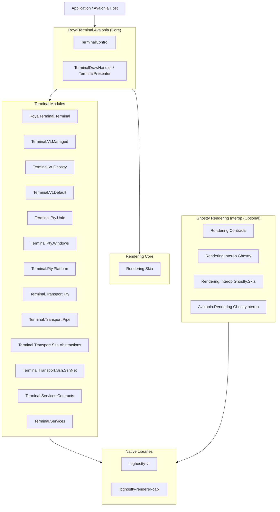

# RoyalTerminal

<p align="center">
  
  
</p>

High-performance .NET 10 terminal stack with a backend-neutral Avalonia core (`RoyalTerminal.Avalonia`), framebuffer shader support, official native Ghostty VT integration (`libghostty-vt`), and a separate fully managed VT implementation.

[](https://dotnet.microsoft.com)
[](https://avaloniaui.net)
[](LICENSE)

Project documentation source lives in [docs/](docs/) and is published through the VitePress/GitHub Pages workflow in [`.github/workflows/docs.yml`](.github/workflows/docs.yml).

## NuGet Packages

### Primary Packages

| Package | NuGet | Description |
|---------|-------|-------------|
| **RoyalTerminal.Avalonia** | [](https://www.nuget.org/packages/RoyalTerminal.Avalonia) | Backend-neutral Avalonia terminal control (`TerminalControl`) and presentation services (no Ghostty dependency) |
| **RoyalTerminal.GhosttySharp** | [](https://www.nuget.org/packages/RoyalTerminal.GhosttySharp) | Core Ghostty VT bindings (`libghostty-vt`) |
| **RoyalTerminal.GhosttySharp.Native.OSX** | [](https://www.nuget.org/packages/RoyalTerminal.GhosttySharp.Native.OSX) | Native runtime assets for macOS (`libghostty-vt`, `libghostty-renderer-capi`) |
| **RoyalTerminal.GhosttySharp.Native.Win64** | [](https://www.nuget.org/packages/RoyalTerminal.GhosttySharp.Native.Win64) | Native runtime assets for Windows x64/arm64 (`ghostty-vt.dll`, `ghostty-renderer-capi.dll`) |
| **RoyalTerminal.GhosttySharp.Native.Linux64** | [](https://www.nuget.org/packages/RoyalTerminal.GhosttySharp.Native.Linux64) | Native runtime assets for Linux (`libghostty-vt.so`, `libghostty-renderer-capi.so`) |

### Modular Managed Packages (Packable Composition Units)

| Package | Responsibility |
|---------|----------------|
| `RoyalTerminal.Terminal` | Core terminal contracts (`ITerminalEndpoint`, `ITerminalInputSink`, `ITerminalSelectionSource`, `ITerminalModeSource`), SSH bootstrap helpers, and screen model |
| `RoyalTerminal.Terminal.Vt.Managed` | Managed VT processor (`BasicVtProcessor`) |
| `RoyalTerminal.Terminal.Vt.Ghostty` | Native VT processor (`GhosttyVtProcessor` over official `libghostty-vt` terminal/render APIs) + `GhosttyVtProcessorProvider` |
| `RoyalTerminal.Terminal.Vt.Default` | Preference-based VT processor factory (`VtProcessorPreference`) |
| `RoyalTerminal.Terminal.Pty.Unix` | Unix PTY implementation (`forkpty`) |
| `RoyalTerminal.Terminal.Pty.Windows` | Windows PTY implementation (ConPTY) |
| `RoyalTerminal.Terminal.Pty.Platform` | Platform PTY factory (`DefaultPtyFactory`) |
| `RoyalTerminal.Terminal.Transport.Pty` | PTY transport provider and wrapper (`PtyTerminalTransportProvider`) |
| `RoyalTerminal.Terminal.Transport.Pipe` | Process pipe transport provider (`PipeTerminalTransportProvider`) |
| `RoyalTerminal.Terminal.Transport.Ssh.Abstractions` | SSH host-key validation contracts |
| `RoyalTerminal.Terminal.Transport.Ssh.SshNet` | SSH transport provider (`SshNetTerminalTransportProvider`) |
| `RoyalTerminal.Terminal.Transport.Ssh.SshNet.Agent` | Optional SSH agent auth contributor for SSH.NET |
| `RoyalTerminal.Terminal.Services.Contracts` | Terminal session service contracts |
| `RoyalTerminal.Terminal.Services` | Terminal session service implementations |
| `RoyalTerminal.Rendering.Text` | Reusable text shaping/fallback subsystem (`HarfBuzzTextShaper`, `TerminalFontResolver`) |
| `RoyalTerminal.Shaders` | Dependency-free shader source models and compatibility translation for Skia Runtime Effect terminal shaders |
| `RoyalTerminal.Rendering.Skia` | CPU cell renderer core (`SkiaTerminalRenderer`, `GlyphCache`) with HarfBuzz shaping, fallback font resolution, and framebuffer shader post-processing |
| `RoyalTerminal.Rendering.Contracts` | Backend-agnostic render contracts (`RenderTargetDescriptor`, capabilities) |
| `RoyalTerminal.Rendering.Interop.Ghostty` | Managed wrapper for `ghostty-renderer-capi` |
| `RoyalTerminal.Rendering.Interop.Ghostty.Skia` | Skia bridge (`SkiaInteropRenderer`) with CPU fallback |
| `RoyalTerminal.Avalonia.Rendering.GhosttyInterop` | Avalonia render-target acquisition and texture interop draw handler |

## Features

- **Core/native VT split**:
  - `RoyalTerminal.Avalonia`: backend-neutral control and services.
  - `RoyalTerminal.Terminal.Vt.Ghostty`: official native VT integration over upstream `libghostty-vt`.
- **Backend-neutral endpoint contracts** (`ITerminalEndpoint`, `ITerminalInputSink`, `ITerminalSelectionSource`, `ITerminalModeSource`) for control reuse across backends.
- **Pluggable transport runtime** (`ITerminalTransportFactory`) supporting PTY, process pipe, SSH, raw TCP, Telnet, and serial sessions.
- **Shared SSH bootstrap helper** (`SshShellBootstrapCommandBuilder`) for consistent POSIX `export` command composition across SSH backends.
- **Pluggable SSH secret persistence** via `ISshSecretStore` + `ISshSecretProtector` with cross-platform secure defaults (`SshSecretProtectionFactory`).
- **Session profiles + persistent settings model** via `TerminalSessionProfile*` contracts, `TerminalSessionProfileSerializer`, and `JsonFileTerminalSessionProfileStore`.
- **Thread-safe output ingestion**: `TerminalControl.WriteOutput(...)` can be called from background SSH/network callbacks (marshaled to UI thread internally).
- **Preference-based VT selection** via `VtProcessorPreference` (`Auto`, `Managed`, `Native`).
- **Three integration modes** with explicit trade-offs between fidelity, portability, and native dependencies.
- **Split rendering architecture**:
  - CPU cell rendering path (`RoyalTerminal.Rendering.Skia`)
  - Managed framebuffer shader pipeline with direct Skia Runtime Effect source plus Ghostty/Shadertoy and Windows Terminal HLSL compatibility adapters
  - GPU interop path (`RoyalTerminal.Rendering.*` + `ghostty-renderer-capi`)
- **Official native VT engine** via `libghostty-vt` terminal/render-state APIs on all supported platforms.
- **Modular PTY and VT packages** (`Terminal.Pty.*`, `Terminal.Vt.*`).
- **HarfBuzz-backed text shaping** with grid-safe fallback behavior and optional diagnostics counters.
- **Grapheme-aware cell model** in managed VT and official native VT render-state paths.
- **Terminal session service split** (`Terminal.Services.Contracts` and `Terminal.Services`).
- **Sample applications**:
  - Avalonia demo (`samples/RoyalTerminal.Demo`) with structured settings categories (`Session`/`Connection`/`Terminal`/`Appearance`/`SSH`/`Logging`), transport forms (`PTY`/`Pipe`/`Raw TCP`/`Telnet`/`Serial`/`SSH`), a tabbed Settings flyout with profile CRUD (`new`/`duplicate`/`delete`/`set default`) and explicit apply/save, session/event logging, shader samples, and terminal behavior toggles (copy-on-select, bell notifications, backspace mode, paste safety, text shaping/ligatures)
  - macOS SwiftUI native tabbed demo (`samples/RoyalTerminal.MacNativeTabbed`) that hosts GhosttyKit directly as a separate native sample, outside the managed `RoyalTerminal.GhosttySharp` surface
  - VT/PTy control catalog CLI (`samples/RoyalTerminal.ControlCatalog`) with managed/Ghostty VT probes, ncurses/TUI parity scenarios, and rich visual rendering galleries

## Transport Session Model

`TerminalControl` now runs through a transport abstraction, not a PTY-only runtime:

1. `TerminalControl.StartSessionAsync(ITerminalTransportOptions)` selects a transport.
2. `ITerminalTransportFactory` resolves a provider by `TransportId`.
3. The chosen `ITerminalTransport` (`pty`, `pipe`, or `ssh`) owns I/O and lifecycle.
4. `TerminalSessionService` remains the coordination point for endpoint/input/selection/mode contracts.

Supported transport option models:

| Transport | Options Type | Notes |
|-----------|--------------|-------|
| PTY | `PtyTransportOptions` | Interactive local shell semantics (ConPTY/forkpty) |
| Pipe | `PipeTransportOptions` | Non-PTY process streams, useful for command/log scenarios |
| SSH | `SshTransportOptions` | Remote terminal sessions with optional PTY request and host-key checks (OpenSSH `known_hosts` and optional SHA-256 pinning) |
| Raw TCP | `RawTcpTransportOptions` | Unframed TCP byte stream sessions |
| Telnet | `TelnetTransportOptions` | Telnet remote sessions with option negotiation handling |
| Serial | `SerialTransportOptions` | Direct serial line sessions (baud/parity/stop bits/handshake) |

## Terminal Capture and Replay

Capture/replay is available for `TerminalControl` and is designed to be reusable outside the demo app.

- **Captured timeline events**:
  - terminal output bytes
  - terminal input bytes sent through session routing
  - terminal resize events
- **Persistence**:
  - JSON file format via `TerminalCaptureSessionSerializer`
  - recommended extension: `.rtcap.json`
- **Replay controls**:
  - play, pause, stop, and seek by timeline position
  - replay surface reset to captured initial dimensions

### Demo Integration (`samples/RoyalTerminal.Demo`)

The demo toolbar includes:

- `Start Capture` / `Stop Capture`
- `Save Capture` (writes capture session to file)
- `Load Replay` (opens a capture file in a replay tab)
- `Settings` (opens tabbed session/profile editor with explicit `Apply` and `Save`)

When replay is active, the replay timeline bar is shown with play/pause, stop, slider seek, elapsed/total display, and source label.

### Reusable API Surface

- `RoyalTerminal.Avalonia.Capture.TerminalCaptureRuntime`
  - runtime orchestration for capture + replay against a `TerminalControl`
- `RoyalTerminal.Terminal.TerminalCaptureRecorder`
  - event recorder with snapshot/finalize semantics
- `RoyalTerminal.Terminal.TerminalCaptureSession`
  - serializable capture payload (metadata + ordered events)
- `RoyalTerminal.Terminal.TerminalCaptureSessionSerializer`
  - stream/file load + save helpers

```csharp
using RoyalTerminal.Avalonia.Capture;
using RoyalTerminal.Avalonia.Controls;
using RoyalTerminal.Terminal;

var terminal = new TerminalControl();
var captureRuntime = new TerminalCaptureRuntime(terminal);

captureRuntime.StartCapture();
terminal.SendInput("ls\r");
terminal.WriteOutput("file1\nfile2\n"u8);

TerminalCaptureSession captured = captureRuntime.StopCapture();
await TerminalCaptureSessionSerializer.SaveToFileAsync(captured, "session.rtcap.json");

TerminalCaptureSession loaded =
    await TerminalCaptureSessionSerializer.LoadFromFileAsync("session.rtcap.json");

captureRuntime.LoadReplay(loaded, "session.rtcap.json");
captureRuntime.PlayReplay();
captureRuntime.SeekReplay(2.5);
captureRuntime.PauseReplay();
captureRuntime.StopReplay();
```

## Integration Modes

| Mode | Control | Package Set | VT Engine | Renderer | PTY | Platform | Best For |
|------|---------|-------------|-----------|----------|-----|----------|----------|
| **Native VT** | `TerminalControl` | `RoyalTerminal.Avalonia` + `RoyalTerminal.Terminal.Vt.Ghostty` + native assets | official `libghostty-vt` terminal/render-state APIs | Skia cell renderer | Unix PTY / ConPTY | macOS/Linux/Windows | Cross-platform native VT parser on the upstream Ghostty C API |
| **Managed VT** | `TerminalControl` | `RoyalTerminal.Avalonia` | `BasicVtProcessor` (C#) | Skia cell renderer | Unix PTY / ConPTY | macOS/Linux/Windows | Explicit managed VT path |
| **Rendered (Auto VT)** | `TerminalControl` | `RoyalTerminal.Avalonia` (+ optional native VT provider packages) | Auto (`libghostty-vt` when available, otherwise `BasicVtProcessor`) | Skia cell renderer | Unix PTY / ConPTY | macOS/Linux/Windows | Default backend-neutral mode |

### Mode Availability and Fallback Policy (Demo)

The demo exposes only cross-platform modes. When native VT is unavailable, mode routing falls back deterministically to the next supported mode.

Resolver cycle order:

`Native VT -> Managed VT -> Rendered (Auto VT)`

Fallback chains when requested mode is unavailable:

| Requested Mode | Fallback Chain (next supported mode in resolver order) |
|----------------|---------------------------------------------------------|
| `Native VT` | `Managed VT -> Rendered (Auto VT)` |
| `Managed VT` | `Rendered (Auto VT)` |
| `Rendered (Auto VT)` | Always supported (no fallback required) |

Mode cycle in the demo also skips unsupported modes and always lands on a runnable mode.

### Demo Tab Mode Indicators

The Avalonia demo uses a glyph + color marker in each tab header:

| Mode | Marker | Color |
|------|--------|-------|
| `Native VT` | `■` | Green (`#6AB04C`) |
| `Managed VT` | `▲` | Teal (`#4EC9B0`) |
| `Rendered (Auto VT)` | `▼` | Olive (`#6A9955`) |

### `TerminalControl` VT Preference Modes

| Demo Mode Label | `VtProcessorPreference` | Behavior |
|-----------------|--------------------------|----------|
| **Native VT** | `Native` | Requires the official native Ghostty VT provider (`libghostty-vt`), throws when unavailable |
| **Managed VT** | `Managed` | Forces `BasicVtProcessor` for deterministic pure-managed behavior |
| **Rendered (Auto VT)** | `Auto` | Uses official native VT when available and falls back to managed VT otherwise |

## Architecture



## Usage

### 1. Backend-Neutral Cross-Platform Control (`RoyalTerminal.Avalonia`)

```csharp
using RoyalTerminal.Avalonia.Controls;
using RoyalTerminal.Terminal;

var terminal = new TerminalControl
{
    FontFamilyName = "JetBrains Mono",
    TerminalFontSize = 14,
    Columns = 120,
    Rows = 40,
    ScrollbackLimit = 10_000,
    VtProcessorPreference = VtProcessorPreference.Auto,
};

terminal.StartPty(
    workingDirectory: Environment.GetFolderPath(Environment.SpecialFolder.UserProfile));
```

`StartPty(...)` remains supported for backwards compatibility. The preferred session API is `StartSessionAsync(...)` with transport options.

### 1a. Unified Session Start (`StartSessionAsync`)

```csharp
using RoyalTerminal.Avalonia.Controls;
using RoyalTerminal.Terminal;

var terminal = new TerminalControl();

ITerminalTransportOptions options = new PtyTransportOptions(
    Command: null,
    WorkingDirectory: Environment.GetFolderPath(Environment.SpecialFolder.UserProfile),
    Environment: null,
    Dimensions: new TerminalSessionDimensions(120, 40, 1200, 800));

await terminal.StartSessionAsync(options);
```

### 1b. Start a Pipe Session (`PipeTransportOptions`)

```csharp
using RoyalTerminal.Avalonia.Controls;
using RoyalTerminal.Terminal;

var terminal = new TerminalControl();

await terminal.StartPipeAsync(
    new PipeTransportOptions(
        Command: new TerminalCommandSpec(
            FileName: "/bin/sh",
            Arguments: new[] { "-lc", "dotnet --info" }),
        WorkingDirectory: null,
        Environment: null,
        MergeStdErrIntoStdOut: true,
        Dimensions: new TerminalSessionDimensions(120, 40, 1200, 800)));
```

### 1c. Start an SSH Session (`SshTransportOptions`)

```csharp
using System;
using System.Collections.Generic;
using RoyalTerminal.Avalonia.Controls;
using RoyalTerminal.Terminal;

var terminal = new TerminalControl();

SshTransportOptions options = new(
    Endpoint: new SshEndpointOptions("example.com", 22, "alice"),
    RequestPty: true,
    TerminalType: "xterm-256color",
    InitialCommand: null,
    Authentication: new SshAuthenticationOptions(
        UsePassword: true,
        PasswordSecretId: "demo-password",
        PrivateKeySecretIds: Array.Empty<string>(),
        UseAgent: false),
    Dimensions: new TerminalSessionDimensions(120, 40, 1200, 800))
{
    ExpectedHostKeyFingerprintSha256 = "SHA256:BASE64_FINGERPRINT",
    EnvironmentVariables = new Dictionary<string, string>(StringComparer.Ordinal)
    {
        ["LANG"] = "en_US.UTF-8",
        ["LC_CTYPE"] = "en_US.UTF-8",
        ["TERM"] = "xterm-256color",
    },
};

await terminal.StartSshAsync(options);
```

`ExpectedHostKeyFingerprintSha256` is optional. When omitted, host-key trust falls back to `KnownHostsSshHostKeyValidator` (OpenSSH `known_hosts`).

`EnvironmentVariables` is optional. When provided, values are applied through a POSIX-shell bootstrap command (`export KEY='value'`) before `InitialCommand`.

Environment-variable validation rules:

- Name must match `[A-Za-z_][A-Za-z0-9_]*`.
- Value must be non-null.
- Value must not contain `CR`, `LF`, or `NUL`.

### 1c.0 Advanced SSH configuration surface (proxy, forwarding, policy)

```csharp
options = options with
{
    Proxy = new SshProxyOptions(
        Type: SshProxyType.Socks5,
        Host: "proxy.example.com",
        Port: 1080,
        Username: "proxy-user",
        Password: "proxy-password"),
    PortForwardings =
    [
        new SshPortForwardOptions(
            Mode: SshPortForwardMode.Local,
            BindAddress: "127.0.0.1",
            SourcePort: 15432,
            DestinationHost: "db.internal",
            DestinationPort: 5432),
    ],
    Policy = new SshPolicyOptions(
        KeepAliveIntervalSeconds: 30,
        ConnectTimeoutSeconds: 15),
};
```

`X11` has an options surface (`SshX11Options`) but is currently not supported by the SSH.NET backend transport and will throw when enabled.

### 1c.1 Reuse SSH Bootstrap Composition in Custom Backends (Rebex, etc.)

If you run SSH with a custom backend instead of `RoyalTerminal.Terminal.Transport.Ssh.SshNet`, use the same bootstrap helper for consistent behavior:

```csharp
using RoyalTerminal.Terminal;

SshTransportOptions options = /* build options */;
string? bootstrap = SshShellBootstrapCommandBuilder.Build(options);

if (!string.IsNullOrWhiteSpace(bootstrap))
{
    // WriteLine to your custom shell channel (for example Rebex shell stream).
    SendLineToRemoteShell(bootstrap);
}
```

You can also use the overload:

```csharp
string? bootstrap = SshShellBootstrapCommandBuilder.Build(
    initialCommand: "exec $SHELL -il",
    environmentVariables: new Dictionary<string, string>
    {
        ["LANG"] = "en_US.UTF-8",
    });
```

### 1d. PTY with Custom Shell Profile

```csharp
using RoyalTerminal.Avalonia.Controls;
using RoyalTerminal.Terminal;

IShellProfileCatalog shellCatalog = new DefaultShellProfileCatalog();
ShellProfile shellProfile = shellCatalog.GetDefaultProfile();

var terminal = new TerminalControl();
await terminal.StartSessionAsync(
    new PtyTransportOptions(
        Command: shellProfile.Command,
        WorkingDirectory: Environment.GetFolderPath(Environment.SpecialFolder.UserProfile),
        Environment: null,
        Dimensions: new TerminalSessionDimensions(120, 40, 1200, 800)));
```

### 1e. SSH Credential Provider Injection

```csharp
using System;
using System.Threading;
using RoyalTerminal.Avalonia.Controls;
using RoyalTerminal.Avalonia.Services;
using RoyalTerminal.Terminal;
using RoyalTerminal.Terminal.Services;
using RoyalTerminal.Terminal.Transport.Ssh;
using RoyalTerminal.Terminal.Transport.Ssh.SshNet;

sealed class RuntimeCredentialProvider : ISshCredentialProvider
{
    public ValueTask<SshResolvedCredentials> ResolveAsync(
        SshCredentialRequest request,
        CancellationToken cancellationToken = default)
    {
        cancellationToken.ThrowIfCancellationRequested();
        return ValueTask.FromResult(
            new SshResolvedCredentials(
                Password: Environment.GetEnvironmentVariable("SSH_PASSWORD"),
                PrivateKeyPemOrPath: Array.Empty<string>(),
                UseAgent: false));
    }
}

var terminal = new TerminalControl(
    new TerminalSessionService(),
    new DefaultTerminalInputAdapter(),
    new DefaultTerminalSelectionService(),
    new DefaultTerminalScrollService(),
    new DefaultVtProcessorFactory(),
    new DefaultPtyFactory(),
    new RuntimeCredentialProvider(),
    new KnownHostsSshHostKeyValidator(),
    transportFactory: null);
```

### 1f. Protected SSH Secret Store (Cross-Platform Default)

```csharp
using System;
using RoyalTerminal.Terminal;

ISshSecretStore secretStore = SshSecretProtectionFactory.CreateDefaultSecretStore();

await secretStore.SaveSecretAsync("ssh/password", "my-password");
await secretStore.SaveSecretAsync("ssh/key/main", "/home/user/.ssh/id_ed25519");

ISshCredentialProvider credentialProvider = new SecretStoreSshCredentialProvider(secretStore);
```

### 1g. Session Profiles and Persistent Settings

```csharp
using RoyalTerminal.Avalonia.Controls;
using RoyalTerminal.Terminal;

TerminalSessionProfilesDocument profiles = new()
{
    Profiles =
    [
        new TerminalSessionProfile
        {
            Id = "dev-ssh",
            DisplayName = "Dev SSH",
            Transport = new TerminalSessionTransportProfile
            {
                TransportId = TerminalTransportIds.Ssh,
                Ssh = new TerminalSessionSshSettings
                {
                    Host = "example.com",
                    Port = 22,
                    Username = "alice",
                    Authentication = new TerminalSessionSshAuthenticationSettings
                    {
                        UsePassword = true,
                        PasswordSecretId = "ssh/dev/password",
                    },
                },
            },
        },
    ],
};

ITerminalSessionProfileStore store = TerminalSessionProfileStoreFactory.CreateDefault();
await store.SaveAsync(profiles);

TerminalSessionProfilesDocument loaded = await store.LoadAsync();
ITerminalTransportOptions options = TerminalSessionProfileMapper.ToTransportOptions(loaded.Profiles[0]);

var terminal = new TerminalControl();
await terminal.StartSessionAsync(options);
```

### 2. Core Control with Native VT Provider (official `libghostty-vt`)

```csharp
using RoyalTerminal.Avalonia.Controls;
using RoyalTerminal.Avalonia.Services;
using RoyalTerminal.Terminal;
using RoyalTerminal.Terminal.Services;

var terminal = new TerminalControl(
    new TerminalSessionService(),
    new DefaultTerminalInputAdapter(),
    new DefaultTerminalSelectionService(),
    new DefaultTerminalScrollService(),
    new DefaultVtProcessorFactory([new GhosttyVtProcessorProvider()]),
    new DefaultPtyFactory())
{
    VtProcessorPreference = VtProcessorPreference.Native,
};

terminal.StartPty();
```

### 3. Core Control with Explicit Managed VT (`BasicVtProcessor`)

```csharp
using RoyalTerminal.Avalonia.Controls;
using RoyalTerminal.Terminal;

var terminal = new TerminalControl
{
    VtProcessorPreference = VtProcessorPreference.Managed,
};

terminal.StartPty();
```

### 4. Attach a Custom Endpoint (`ITerminalEndpoint`)

```csharp
using System;
using System.Text;
using RoyalTerminal.Avalonia.Controls;
using RoyalTerminal.Terminal;

sealed class LoggingEndpoint : ITerminalEndpoint
{
    public void SendText(ReadOnlySpan<byte> utf8)
        => Console.WriteLine($"INPUT: {Encoding.UTF8.GetString(utf8)}");

    public void SetFocus(bool focused)
        => Console.WriteLine($"FOCUS: {focused}");

    public void SetSize(int widthPx, int heightPx)
        => Console.WriteLine($"SIZE: {widthPx}x{heightPx}");
}

var terminal = new TerminalControl();
terminal.AttachEndpoint(new LoggingEndpoint());
terminal.SendInput("echo hello\n");
terminal.DetachEndpoint();
```

`TerminalControl` supports two endpoint integration levels:

- `ITerminalEndpoint` only (byte-stream integration): fallback key/text/mouse/focus VT sequences are written through `SendText(...)`.
- `ITerminalEndpoint` + `ITerminalInputSink` (full-fidelity event integration): structured key/text/pointer events are passed directly to your backend.

### 4a. Comprehensive Custom SSH Endpoint Setup (Rebex or Other SSH SDKs)

Use this model when you own the SSH channel/session lifecycle and only need `TerminalControl` for VT parsing, rendering, and input mapping:

```csharp
using System;
using RoyalTerminal.Avalonia.Controls;
using RoyalTerminal.Terminal;

sealed class ByteStreamSshEndpoint : ITerminalEndpoint
{
    private readonly Action<byte[]> _sendBytes;
    private readonly Action<bool> _setRemoteFocus;
    private readonly Action<int, int> _setRemoteSizePx;

    public ByteStreamSshEndpoint(
        Action<byte[]> sendBytes,
        Action<bool> setRemoteFocus,
        Action<int, int> setRemoteSizePx)
    {
        _sendBytes = sendBytes;
        _setRemoteFocus = setRemoteFocus;
        _setRemoteSizePx = setRemoteSizePx;
    }

    public void SendText(ReadOnlySpan<byte> utf8) => _sendBytes(utf8.ToArray());
    public void SetFocus(bool focused) => _setRemoteFocus(focused);
    public void SetSize(int widthPx, int heightPx) => _setRemoteSizePx(widthPx, heightPx);
}

var terminal = new TerminalControl
{
    VtProcessorPreference = VtProcessorPreference.Managed,
};

var endpoint = new ByteStreamSshEndpoint(
    sendBytes: bytes => SendBytesToSshShell(bytes),          // your SSH write path
    setRemoteFocus: focused => NotifySshFocus(focused),      // optional backend-specific signal
    setRemoteSizePx: (w, h) => NotifySshPixelSize(w, h));    // optional backend-specific signal

terminal.AttachEndpoint(endpoint);

// Route remote output to TerminalControl from any thread (network callback thread is fine).
OnSshData((buffer, length) =>
{
    terminal.WriteOutput(buffer.AsSpan(0, length));
});
```

Behavior when using endpoint-only mode:

- Keyboard and text input are encoded to VT byte sequences and sent through `ITerminalEndpoint.SendText(...)`.
- Mouse reporting sequences are sent through `SendText(...)` when mouse modes are enabled (for example DECSET `1000`/`1002`/`1003` with SGR `1006`).
- Focus in/out (`CSI I` / `CSI O`) is sent through `SendText(...)` when focus mode DECSET `1004` is enabled.
- `WriteOutput(...)` is safe from background callback threads; `TerminalControl` marshals processing to the UI thread internally.
- Mode state is normally learned from the stream you feed into `WriteOutput(...)`; if your backend tracks modes separately, expose them via `ITerminalModeSource` (and optionally `ITerminalFocusEventModeSource`).

If you implement `ITerminalInputSink`, fallback byte-sequence encoding is bypassed and your backend receives structured `TerminalKeyEvent` / `TerminalPointerEvent`.

### 5. Renderer Shaping Controls and Diagnostics

```csharp
using RoyalTerminal.Avalonia.Controls;
using RoyalTerminal.Avalonia.Rendering;

var terminal = new TerminalControl();
terminal.StartPty();

if (terminal.Renderer is { } renderer)
{
    renderer.EnableTextShaping = true;
    renderer.TextDirectionMode = TextDirectionMode.Auto;
    renderer.EnableLigatures = false;
    renderer.EnableTextRenderDiagnostics = true;

    TextRenderDiagnostics diagnostics = renderer.GetTextRenderDiagnostics(reset: true);
}
```

### 6. Direct Renderer Interop (No Avalonia Adapter)

```csharp
using RoyalTerminal.Rendering.Contracts;
using RoyalTerminal.Rendering.Interop.Ghostty;

using var context = new GhosttyRenderContext();
using var surface = context.CreateSurface(RenderBackendKind.Software);

surface.SetSize(800, 600);
surface.SetScale(1.0, 1.0);

ulong frameToken = surface.BeginFrame();
byte[] rgba = new byte[800 * 600 * 4];
RenderFrameResult frame = surface.RenderToRgba(rgba, 800, 600, 800 * 4);
surface.EndFrame(frameToken);
```

## Migration Guide

### Existing PTY Users

- `TerminalControl.StartPty(...)` is still supported and remains the compatibility API.
- `TerminalControl.Pty` and `TerminalControl.HasPty` still work for PTY sessions.
- VT response writeback now goes through session input routing, so no PTY-specific handling is required in callers.

### Preferred New Session API

- New code should use `StartSessionAsync(...)`, `StartPipeAsync(...)`, or `StartSshAsync(...)`.
- Query active session state with:
  - `TerminalControl.HasActiveSession`
  - `TerminalControl.ActiveTransportId`

### API Name and Package Changes

- Core control rename:
  - `GhosttyTerminalControl` -> `TerminalControl`
  - `GhosttyTerminalPresenter` -> `TerminalPresenter`
- VT selection moved from `UseNativeVtProcessor` to `VtProcessorPreference`.
- Legacy surface-coupled `ITerminalSurface` contract was removed.

## Installation

### Backend-Neutral Setup (No Ghostty Dependency)

```bash
# Core Avalonia control + PTY + managed VT defaults

dotnet add package RoyalTerminal.Avalonia
```

### Optional Native VT for Core Control

```bash
# Native VT provider over official libghostty-vt bindings

dotnet add package RoyalTerminal.Terminal.Vt.Ghostty

# Native runtime assets (pick your target platforms)
dotnet add package RoyalTerminal.GhosttySharp.Native.OSX
dotnet add package RoyalTerminal.GhosttySharp.Native.Linux64
dotnet add package RoyalTerminal.GhosttySharp.Native.Win64
```

### Optional SSH Transport Packages

```bash
dotnet add package RoyalTerminal.Terminal.Transport.Ssh.Abstractions
dotnet add package RoyalTerminal.Terminal.Transport.Ssh.SshNet

# Optional SSH agent auth adapter
dotnet add package RoyalTerminal.Terminal.Transport.Ssh.SshNet.Agent
```

If you integrate a custom SSH SDK (for example Rebex) via `AttachEndpoint(...)`, you can skip SSH.NET packages and use:

```bash
dotnet add package RoyalTerminal.Avalonia
dotnet add package RoyalTerminal.Terminal
```

### Modular Rendering Interop Setup

Use this when embedding the renderer interop pipeline directly (for `TextureInterop` or custom integrations):

```bash
dotnet add package RoyalTerminal.Rendering.Contracts
dotnet add package RoyalTerminal.Rendering.Interop.Ghostty
dotnet add package RoyalTerminal.Shaders
dotnet add package RoyalTerminal.Rendering.Skia
dotnet add package RoyalTerminal.Rendering.Interop.Ghostty.Skia
dotnet add package RoyalTerminal.Avalonia.Rendering.GhosttyInterop
```

If your feed does not yet publish these composition packages, create them from source with `dotnet pack -c Release` and consume from your local/internal feed.

## Codex SKILL

This repository includes a Codex skill:

- `skills/royalterminal-development`

### Install to Codex Skills Directory

From the repository root:

```bash
SKILL_NAME="royalterminal-development"
CODEX_SKILLS_DIR="${CODEX_HOME:-$HOME/.codex}/skills"

mkdir -p "$CODEX_SKILLS_DIR"
cp -R "skills/$SKILL_NAME" "$CODEX_SKILLS_DIR/$SKILL_NAME"
```

### Install as Symlink (recommended while iterating on the skill)

```bash
SKILL_NAME="royalterminal-development"
CODEX_SKILLS_DIR="${CODEX_HOME:-$HOME/.codex}/skills"

mkdir -p "$CODEX_SKILLS_DIR"
ln -sfn "$(pwd)/skills/$SKILL_NAME" "$CODEX_SKILLS_DIR/$SKILL_NAME"
```

### Verify Install

```bash
test -f "${CODEX_HOME:-$HOME/.codex}/skills/royalterminal-development/SKILL.md" && echo "skill installed"
```

### Skill Entry Files

- Skill instructions: `skills/royalterminal-development/SKILL.md`
- Granular references: `skills/royalterminal-development/references/`

## Feature Comparison

| Capability | Native VT (`TerminalControl`) | Managed VT (`TerminalControl`) | Rendered (`TerminalControl`, Auto VT) |
|------------|--------------------------------|--------------------------------|---------------------------------------|
| Package entry point | `RoyalTerminal.Avalonia` + `Terminal.Vt.Ghostty` | `RoyalTerminal.Avalonia` | `RoyalTerminal.Avalonia` |
| Platform availability | macOS/Linux/Windows | macOS/Linux/Windows | macOS/Linux/Windows |
| VT engine | official `libghostty-vt` | `BasicVtProcessor` | auto-selects native VT when available, otherwise managed VT |
| Renderer path | Skia cell renderer | Skia cell renderer | Skia cell renderer |
| Requires `libghostty-vt` | Yes | No | Optional |
| Full Avalonia overlay support | Yes | Yes | Yes |
| Cross-platform mode | Yes | Yes | Yes |
| Demo fallback when unavailable | Routed to `Managed VT` then `Rendered` | Routed to `Rendered` | Always supported |

## Rendering Interop Contract

`RoyalTerminal.Rendering.Contracts` defines the backend-neutral model:

- `RenderBackendKind`: `Software`, `Metal`, `Vulkan`, `D3D11`, `D3D12`, `OpenGL`
- `RenderTargetDescriptor`: native handle carrier for one render target submission
- `RenderBackendCapabilities`: supported features/sample counts/pixel formats
- `RenderFeatureFlags`: `ExternalTextureTargets`, `ExternalFramebufferTargets`, `CpuRgbaFallback`, `ExplicitFrameLifecycle`, etc.

`RoyalTerminal.Rendering.Interop.Ghostty.Skia` (`SkiaInteropRenderer`) behavior:

1. Validate descriptor.
2. Attempt direct interop only when surface capabilities advertise the target kind (`ExternalTextureTargets` or `ExternalFramebufferTargets`).
3. Fall back to CPU RGBA path when direct interop is unavailable or fails and fallback is enabled.

## Native Renderer C API (`ghostty-renderer-capi`)

`native/ghostty-renderer-capi` exports:

- Context/surface lifecycle
- Surface configuration (`set_size`, `set_scale`, `set_focus`, `set_color_scheme`)
- Explicit frame lifecycle (`begin_frame` / `end_frame`)
- Target validation and rendering (`validate_target`, `render_to_target`)
- CPU fallback rendering (`render_to_rgba`)

Header: `native/ghostty-renderer-capi/include/ghostty_renderer.h`

Build directly:

```bash
cd native/ghostty-renderer-capi
bash build.sh release
bash build.sh test
```

## Official VT Library (`libghostty-vt`)

`libghostty-vt` is now the only native VT engine used by RoyalTerminal. `GhosttyVtProcessor`
drives the upstream terminal and render-state APIs directly, with no custom standalone wrapper.

Build directly:

```bash
cd external/ghostty
zig build -Doptimize=ReleaseFast -Dapp-runtime=none
```

## Ghostty Submodule Status

RoyalTerminal now tracks upstream Ghostty directly in `external/ghostty`; the local
Ghostty fork patches and managed `libghostty` wrapper layer were removed. The
managed/native integration now targets upstream `libghostty-vt` directly, with
`ghostty-renderer-capi` retained only for optional render-target interop.

## PTY Layer

| Package | Implementation |
|---------|----------------|
| `RoyalTerminal.Terminal.Pty.Unix` | `UnixPty` (`forkpty`, `TIOCSWINSZ`) |
| `RoyalTerminal.Terminal.Pty.Windows` | `WindowsPty` (ConPTY) |
| `RoyalTerminal.Terminal.Pty.Platform` | `DefaultPtyFactory` selector |

## Native Library Resolution

Renderer interop (`RoyalTerminal.Rendering.Interop.Ghostty`) supports:

- `GHOSTTY_RENDERER_CAPI_LIBRARY_PATH` (absolute file path)
- `GHOSTTY_RENDERER_CAPI_LIBRARY_DIR` (directory containing the library)

Probe order includes:

1. Explicit env vars above
2. `runtimes/<rid>/native/` next to app base directory
3. `runtimes/<rid>/native/` next to assembly directory
4. Default OS loader paths

## Native Libraries and Placement

| Platform | Files |
|----------|-------|
| macOS | `libghostty-vt.dylib`, `libghostty-renderer-capi.dylib` |
| Linux | `libghostty-vt.so`, `libghostty-renderer-capi.so` |
| Windows | `ghostty-vt.dll`, `ghostty-renderer-capi.dll` |

Primary runtime package locations:

- `src/RoyalTerminal.GhosttySharp.Native.OSX/runtimes/<rid>/native/`
- `src/RoyalTerminal.GhosttySharp.Native.Linux64/runtimes/<rid>/native/`
- `src/RoyalTerminal.GhosttySharp.Native.Win64/runtimes/<rid>/native/`

## Project Structure

```text
RoyalTerminal/
├── Directory.Build.props
├── Directory.Packages.props
├── RoyalTerminal.sln
├── native/
│   └── ghostty-renderer-capi/
├── src/
│   ├── RoyalTerminal.GhosttySharp/
│   ├── RoyalTerminal.Avalonia/
│   ├── RoyalTerminal.Avalonia.Rendering.GhosttyInterop/
│   ├── RoyalTerminal.Terminal/
│   ├── RoyalTerminal.Terminal.Vt.Managed/
│   ├── RoyalTerminal.Terminal.Vt.Ghostty/
│   ├── RoyalTerminal.Terminal.Vt.Default/
│   ├── RoyalTerminal.Terminal.Pty.Unix/
│   ├── RoyalTerminal.Terminal.Pty.Windows/
│   ├── RoyalTerminal.Terminal.Pty.Platform/
│   ├── RoyalTerminal.Terminal.Services.Contracts/
│   ├── RoyalTerminal.Terminal.Services/
│   ├── RoyalTerminal.Rendering.Text/
│   ├── RoyalTerminal.Shaders/
│   ├── RoyalTerminal.Rendering.Contracts/
│   ├── RoyalTerminal.Rendering.Interop.Ghostty/
│   ├── RoyalTerminal.Rendering.Skia/
│   ├── RoyalTerminal.Rendering.Interop.Ghostty.Skia/
│   ├── RoyalTerminal.GhosttySharp.Native.OSX/
│   ├── RoyalTerminal.GhosttySharp.Native.Linux64/
│   └── RoyalTerminal.GhosttySharp.Native.Win64/
├── samples/RoyalTerminal.Demo/
├── samples/RoyalTerminal.MacNativeTabbed/
├── samples/RoyalTerminal.ControlCatalog/
├── tests/
│   ├── RoyalTerminal.Benchmarks/
│   ├── RoyalTerminal.Tests/
│   └── RoyalTerminal.IntegrationTests/
└── scripts/
    ├── build-native.sh
    └── build-native.ps1
```

## Building

### Prerequisites

- .NET 10 SDK
- Zig 0.15.2+
- Ghostty submodule:

```bash
git submodule update --init --recursive
```

Windows-specific prerequisite:
- Symlink creation must be available for Zig package extraction.
- Enable Developer Mode (`start ms-settings:developers`) or run PowerShell as Administrator.
- `scripts/build-native.ps1` uses a repository-local Zig global cache at `.zig-global-cache` to avoid stale user-level cache state.

### Build Native + Managed

```bash
# macOS/Linux
bash scripts/build-native.sh --release

# Windows
pwsh scripts/build-native.ps1 -Release

# Managed build
dotnet build RoyalTerminal.sln -c Release
```

### Run Demo

```bash
dotnet run --project samples/RoyalTerminal.Demo
```

### Run Control Catalog CLI

```bash
dotnet run --project samples/RoyalTerminal.ControlCatalog
```

Optional demo toggles:

```bash
ROYALTERMINAL_DISABLE_TEXT_SHAPING=1 \
ROYALTERMINAL_ENABLE_RENDER_DIAGNOSTICS=1 \
dotnet run --project samples/RoyalTerminal.Demo
```

### Run macOS Native SwiftUI Sample

```bash
swift run --package-path samples/RoyalTerminal.MacNativeTabbed
```

## Testing

```bash
# Full test pass
dotnet test RoyalTerminal.sln -c Release

# Rendering-focused tests
dotnet test tests/RoyalTerminal.Tests/RoyalTerminal.Tests.csproj -c Release --filter "RenderingInteropTests|RenderingSkiaInteropTests|RenderingAvaloniaAdapterTests|RenderingContractsTests"

# Optional SSH transport integration tests (env-gated)
ROYALTERMINAL_IT_SSH_HOST=127.0.0.1 \
ROYALTERMINAL_IT_SSH_PORT=22 \
ROYALTERMINAL_IT_SSH_USERNAME=test-user \
ROYALTERMINAL_IT_SSH_PASSWORD=secret \
ROYALTERMINAL_IT_SSH_HOST_KEY_SHA256=SHA256:your-host-key-fingerprint \
dotnet test tests/RoyalTerminal.IntegrationTests/RoyalTerminal.IntegrationTests.csproj -c Release --filter "SshTransportIntegrationTests"

# Optional key-based auth for SSH integration tests
# ROYALTERMINAL_IT_SSH_PRIVATE_KEY can contain either a PEM payload or a private-key file path.
```

### Ncurses Harness (Manual Mouse/Keyboard/Resize Validation)

The ncurses harness fixture lives at:

`tests/RoyalTerminal.Tests/Fixtures/NcursesHarness.py`

Important: it **requires** `RT_HARNESS_LOG`. If this variable is missing, the script exits immediately.

Run it manually:

```bash
RT_HARNESS_LOG=/tmp/rt-harness.log \
RT_HARNESS_TIMEOUT_SEC=300 \
TERM=xterm-256color \
python3 tests/RoyalTerminal.Tests/Fixtures/NcursesHarness.py
```

While it is running:

- Press keys (logs `KEY ...`)
- Click/scroll in the terminal viewport (logs `MOUSE ...`)
- Resize window (logs `RESIZE ...`)
- Press `q` to quit (logs `EXIT quit`)

Watch events from another terminal:

```bash
tail -f /tmp/rt-harness.log
```

If a previous app (for example `mc`) is suspended, resume/terminate it before running the harness:

```bash
jobs
fg %1   # or: kill %1
```

Current baseline in this repository:

- Unit tests: 369 passed
- Integration tests: 47 passed

Performance baseline harness:

```bash
dotnet run --project tests/RoyalTerminal.Benchmarks/RoyalTerminal.Benchmarks.csproj -c Release -- --output /tmp/royalterminal-render-baseline.md
```

## API Coverage

### `libghostty-vt`

| Category | Status |
|----------|--------|
| Terminal lifecycle/process/resize/reset | Implemented |
| Render-state lifecycle and dirty tracking | Implemented |
| Row/cell/grapheme iteration via render state | Implemented |
| Default/palette color APIs | Implemented |
| Mode queries, focus, size-report, formatter, key/mouse helpers | Implemented |

### `ghostty-renderer-capi`

| Category | Status |
|----------|--------|
| Context/surface lifecycle | Implemented |
| Target validation + render-to-target | Implemented |
| CPU RGBA fallback | Implemented |
| Backend descriptors (Metal/Vulkan/D3D11/D3D12/OpenGL/Software) | Implemented end-to-end (validation + direct-target render dispatch + CPU fallback) |

## Notes

- `ReactiveUI`, `ReactiveUI.Avalonia`, and `ReactiveUI.SourceGenerators` are used by the demo app only.
- Library packages remain framework/service oriented and avoid app-level ReactiveUI dependencies.

## License

[MIT](LICENSE)

## Acknowledgements

- [Ghostty](https://github.com/ghostty-org/ghostty)
- [Avalonia UI](https://avaloniaui.net/)
- [SkiaSharp](https://github.com/mono/SkiaSharp)
- [Zig](https://ziglang.org/)
